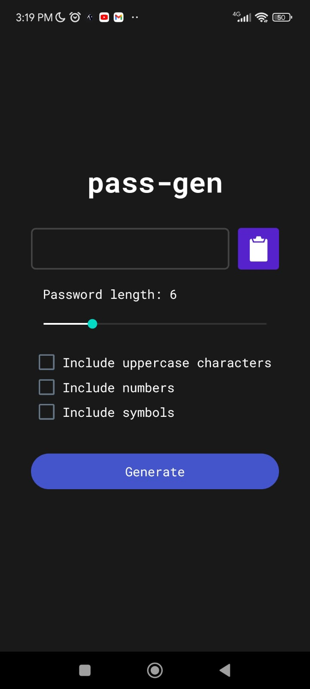

# pass-gen


## ✉ About

A project where you can generate safe passwords.
Made using React, React Native, Typescript and Expo.

## 🌆 Images





## ⚠ Requirements

In order to run the project, you will need:

- Node
- A web browser (Chrome, Firefox, Edge, etc...)
- A mobile device OR a mobile emulator

## 💻 Technologies Used

### FRONTEND

- React
- Styled Components
- Typescript

### MOBILE

- React Native
- Expo

### EDITOR

- Visual Studio Code

## ⬇ How to download the project

```bash

git clone https://github.com/arthur-lage/pass-gen.git

cd pass-gen

# MOBILE

cd mobile

npm install -g expo-cli

npm install

expo start

# WEB

cd web

npm install

npm run dev

```

## 🔗 How to use the app

If you wish to test the application, click the link below:

[Web](https://pass-gen-al.vercel.com)

[Mobile](https://github.com/arthur-lage/pass-gen/releases/tag/Release)